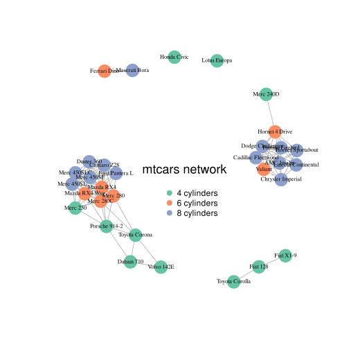

Aside
================================================================================

```{r, label='aside-graph', include=FALSE}
# library
library(igraph)
# Make a correlation matrix:
mat <- cor(t(mtcars[,c(1,3:6)]))
# Keep only high correlations
mat[mat<0.995] <- 0
# Make an Igraph object from this matrix:
network <- graph_from_adjacency_matrix( mat, weighted=T, mode="undirected", diag=F)
# Basic chart
plot(network)
# color palette
library(RColorBrewer)
coul <- brewer.pal(nlevels(as.factor(mtcars$cyl)), "Set2")

# Map the color to cylinders
my_color <- coul[as.numeric(as.factor(mtcars$cyl))]
# plot
par(bg="grey13", mar=c(0,0,0,0))
set.seed(4)
# save plot
svg("cv_graph.svg")
plot(network,
    vertex.size=12,
    vertex.color=my_color,
    vertex.label.cex=0.7,
    vertex.label.color="black",
    vertex.frame.color="transparent"
    )
# title and legend
text(0,0,"mtcars network",col="black", cex=1.5)
legend(x=-0.2, y=-0.12,
       legend=paste( levels(as.factor(mtcars$cyl)), " cylinders", sep=""),
       col = coul ,
       bty = "n", pch=20 , pt.cex = 2, cex = 1,
       text.col="black" , horiz = F)
dev.off()
```

{width=80%}

Contact Info {#contact}
--------------------------------------------------------------------------------

<i class="fa fa-envelope"></i>
g.m.bernardo.harrington@keele.ac.uk

- <i class="fa fa-github"></i> [GitHub: H-Mateus](https://github.com/H-Mateus)
- <i class="fa fa-home"></i> [Personal website](https://gmbernardoharrington.netlify.app/)
- For more information, please see my personal website linked above, or contact me via email.

Grants and awards {#grants}
--------------------------------------------------------------------------------

- Awarded £4,000 consumable grant from the Centre for Doctoral Training for metabolomics experiments, 2021

- Awarded travel grant from the Keele Postgraduate Research Committee to attend an international conference, 2020 (switched to a virtual setting owing to COVID-19

- [Duke of Edinburgh](https://www.dofe.org/) silver award, 2010

Disclaimer {#disclaimer}
--------------------------------------------------------------------------------

Last updated on `r Sys.Date()`.

Main
================================================================================

<p style='font-size: 25px'>Gabriel Mateus Bernardo Harrington</style> {#title}
--------------------------------------------------------------------------------

### Research profile

Currently a final-year PhD student at Keele University based in the Spinal Studies group at The Robert Jones and Agnes Hunt Orthopaedic Hospital.
Spinal cord injury (SCI) is damage to the spinal cord due to trauma, degeneration or disease that results in a temporary or permanent change to its neurological function, recovery from which is highly variable.
SCI can lead to devastating consequences for both the physical and mental health of patients, particularly due to the uncertainty of neurological outcomes in the first two weeks post-injury.
The variability of recovery has also stymied development of novel therapies as it makes powering clinical trials extremely difficult.

I endeavour to discover novel biomarkers of SCI outcomes, both to minimise this uncertainty and to expand our understanding of the underlying pathology of neurological recovery.
I use a combination of modelling historic patient data and proteomic techniques to this end, and have found evidence of a relationship between markers of liver health and SCI recovery.
I am currently validating our prior models with external datasets and seeking to carry out a metabolomics experiment to better elucidate the link between the liver and SCI.

The lab rotations in the first year of my PhD also allowed me to greatly develop my skills at the bench.
At Loughborough University, I investigated dynamic expression of functionally relevant genetic markers in adherent and non-adherent hydrogels, where I gained experience in 3D tissue culture, hydrogels and PCR.
At Nottingham University I studied the effects of alternating current on interfacing wires grown via wireless electrochemistry.
I optimised a new technique for fabricating a cellular-electrical bioelectronic system and gained experience in 3D printing, electrodeposition and microscopy.
At Keele University focused on a "lung on a chip" model, where I cultured multiple cell types in 3D constructs and compared viability and grow kinetics via cell staining, fluorescent microscopy and cell viability assays.
These experiences have given me a highly cross-disciplinary skillset making me a flexible and versatile scientist.

Education {data-icon=graduation-cap data-concise=true}
--------------------------------------------------------------------------------

### Lancaster University

BSc in Biological Sciences, 2:1

Lancaster, UK

2016

Dissertation: 5-prime genotyping of Enterovirus 71

### Keele University

PhD Student

Oswestry, UK

2017 - present (Expected submission 2021)

Thesis: Exploring the serum proteome of spinal cord injured patients: Identifying prognostic biomarkers and new treatment targets

Skills {data-icon=suitcase}
--------------------------------------------------------------------------------

###

Experience in:

N/A

N/A

::: concise
- Statistical learning models
- Proteomics
- Patient data
- Electronic health data
- Use of super computers for modelling
- Submission for ethical approval of research
- Working under the jurisdiction of the Human Tissue Act
- Technical and lay-friendly science communication via oral and poster presentations at conferences, career guidance at local schools and booth presentations at science fairs.
- Highly skilled in R, Bash, Python, LaTeX, SQL, Linux
- Wet lab work including 3D tissue culture, microscopy and research animal handling, PCR
:::

Research Experience {data-icon=laptop}
--------------------------------------------------------------------------------

### Graduate Research Internship

Bionics Institute

Melbourne, Australia

2016 - 2017

- Began initial work towards building a next-generation cochlea implant
- Established the viability of using a viral vector for optogenetic modification of mouse cochlea
- Gained extensive experience in immunohistochemistry, cryosectioning, imaging, research animal handling

```{r eval=FALSE, include=FALSE}
Professional Experience {data-icon=suitcase}
--------------------------------------------------------------------------------

### Data Scientist, intern

temp

temp, location

2014

::: concise
- Taught R language to beginners.
- Wrote Shiny app demos.
- Converted statistical tutorials from SPSS to R language.
:::


Teaching Experience {data-icon=chalkboard-teacher}
--------------------------------------------------------------------------------

### Introduction to R Language for Beginners.

temp

temp, location

2014
```

Selected Publications {data-icon=file}
--------------------------------------------------------------------------------

### [A Preliminary Cohort Study Assessing Routine Blood Analyte Levels and Neurological Outcome after Spinal Cord Injury](https://doi.org/10.1089/neu.2019.6495)

Journal of Neurotrauma 2020 Jan 9

N/A

2020

Sharon J. Brown, **Gabriel Mateus Bernardo Harrington**, Charlotte H. Hulme, Rachel Morris, Anna Bennett, Wai-Hung Tsang, Aheed Osman, Joy Chowdhury, Naveen Kumar, and Karina T. Wright

### [Routinely Measured Hematological Markers Can Help to Predict American Spinal Injury Association Impairment Scale Scores after Spinal Cord Injury](https://doi.org/10.1089/neu.2020.7144)

Journal of Neurotrauma 2020 Aug 28

N/A

2020

**Gabriel Mateus Bernardo Harrington**, Paul Cool, Charlotte Hulme, Aheed Osman, Joy Roy Chowdhury, Naveen Kumar, Srinivasa Budithi, and Karina Wright

Oral presentations {data-icon=chalkboard-teacher}
--------------------------------------------------------------------------------

### Biomarkers for SCI

Postgraduate Conference, 2018

Keele University

2018

Gabriel Mateus Bernardo Harrington

### Reproducible Research

[Centre for Doctoral Training (CDT)](https://epsrc.ukri.org/skills/students/centres/) Conference, 2019

Manchester University

2019

Gabriel Mateus Bernardo Harrington

Poster presentations {data-icon=chalkboard-teacher}
--------------------------------------------------------------------------------

### [Proteomic analysis of bloods from SCI patients](https://gmbernardoharrington.netlify.app/2020/06/08/joint-cdt-conference-2020/)

CDT Joint conference, 2020

Virtual

2020

**Gabriel Mateus Bernardo Harrington**, Charlotte H. Hulme, Paul Cool, Karina T. Wright
