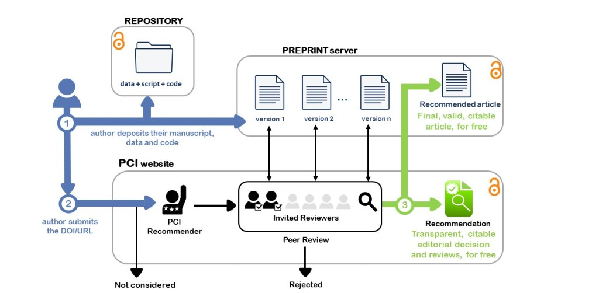
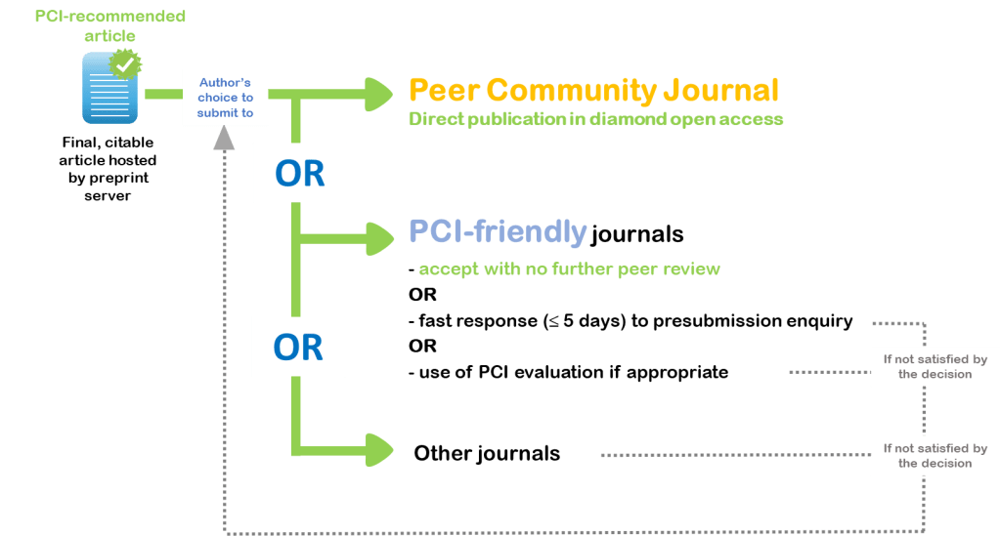

```{r, label='setup-options', include=FALSE}
knitr::opts_chunk$set(
  eval = TRUE, # eval code chunks
  echo = FALSE, # include source code
  #fig.width = 6, # set figure dims
  #fig.height = 6
  fig.align = 'center',
  warning = FALSE, # exclude warnings
  message = FALSE, # exclude messages
  error = FALSE # exclude errors
)
```

It's been a while since my last post where I outlined [ideas for how science may be done better](../../../../post/how-might-science-be-done-better/).
In the interim I've submitting my PhD thesis and am impatiently awaiting my *viva* (where one defends their thesis to experts, which you need to pass to be awarded your PhD!).
I also started my new role as a *Research Associate* (the posh formal title for a Post-Doc) at the [Dementia Research Institute](https://ukdri.ac.uk/) at [Cardiff University](https://www.cardiff.ac.uk/) which has been a good mix of exciting and terrifying.

But, I recently came across a really cool initiative that attempts to implement some of the ideas I explored in the [last post](../../../../post/how-might-science-be-done-better/), called the [Peer Community in](https://peercommunityin.org/).

<center>
```{r, echo=FALSE, fig.cap='Image credit: [**PCI**](https://peercommunityin.org/)'}

```
</center>

Looking at the above outline, the PCI works by inviting authors to first submit their papers to a preprint servers with their code and data.
Then the authors can submit their DOI to the PCI whereupon a member of the community can recommend the paper as worthy of review.
Then others in the community are invited to review the paper, and go through a typical peer-review process with new versions being updated on the preprint server.
Once the reviewers are happy that the paper is of sufficient quality they give the article a recommendation, which itself is a separate, citable document with a DOI.

At this stage the authors can submit their article to a [PCI-friendly journal](https://peercommunityin.org/pci-friendly-journals/) which will typically accept the recommended paper without applying their own peer-review process.
The key benefit here is that the peer-review is divorced from the various biases a journal can bring to this process.
The PCI also have their own [Peer Community Journal](https://peercommunityjournal.org/) which will always accept the recommendation and publish the article as open-access for free!

<center>
```{r, label='pci-journals', fig.cap='Image credit: [**PCI**](https://peercommunityin.org/pci-friendly-journals/)'}

```
</center>

This last option of publishing with the Peer Community Journal is particularly appealing to me, especially at a time where other journals are exploiting their position to charge an outrageous open-access fee [of up to €9,500 ($11,500) per paper](https://www.nature.com/articles/d41586-020-03324-y).
I won't rehash my rant outlining my feeling towards these parasitic journals, if you need a refresher though, that post can be [found here](../../../../post/the-sovereign-of-science/).

They also have a video explaining the process I'd recommend watching:

<center>
<iframe width="560" height="315" src="https://www.youtube.com/embed/4PZhpnc8wwo" title="YouTube video player" frameborder="0" allow="accelerometer; autoplay; clipboard-write; encrypted-media; gyroscope; picture-in-picture" allowfullscreen></iframe>
</center>

I will certainly support this model in my future work as much as I am able to, and encourage any of my peers to do the same.
I truly hope this model finds success as I firmly believe it will lead to fairer and better quality science.

If you're keen to support PCI, please see their guidance [here](https://peercommunityin.org/#researcher)!
